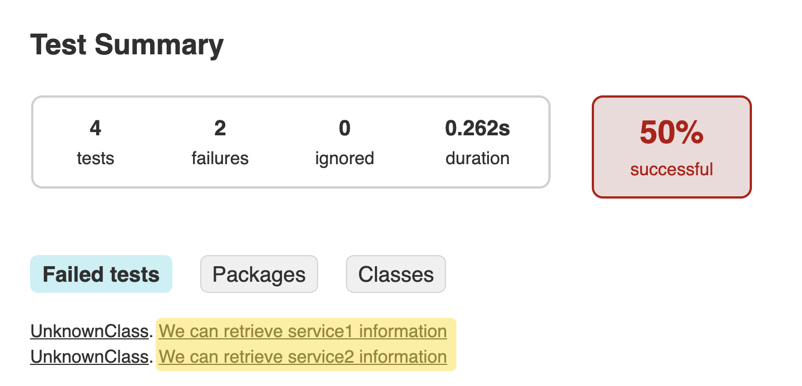

## Cucumber with multiple Spring Contexts (using JUnit5)

[Demo repository to demonstrate ISSUE 2294](https://github.com/cucumber/cucumber-jvm/issues/2294)


### This is a multimodule project. 

```
rootProject.name = 'cucumber-multimodule'
include 'micro:service1'
include 'micro:service2'
include 'acceptance'     # cucumber tests of service1, service2
```
executed tests:
```
gradle test
```
Check Error in this file:

*cucumber-multimodule/acceptance/build/reports/tests/test/index.html*


Follow the link (refer to Screenshot below) to display the Error:

*io.cucumber.core.backend.CucumberBackendException: Glue class*
*milesahead.micro.service1.CucumberService1Test and class*
*milesahead.micro.service2.CucumberService2Test are both annotated*
*with @CucumberContextConfiguration.*
**Please ensure only one class configures the spring context**



